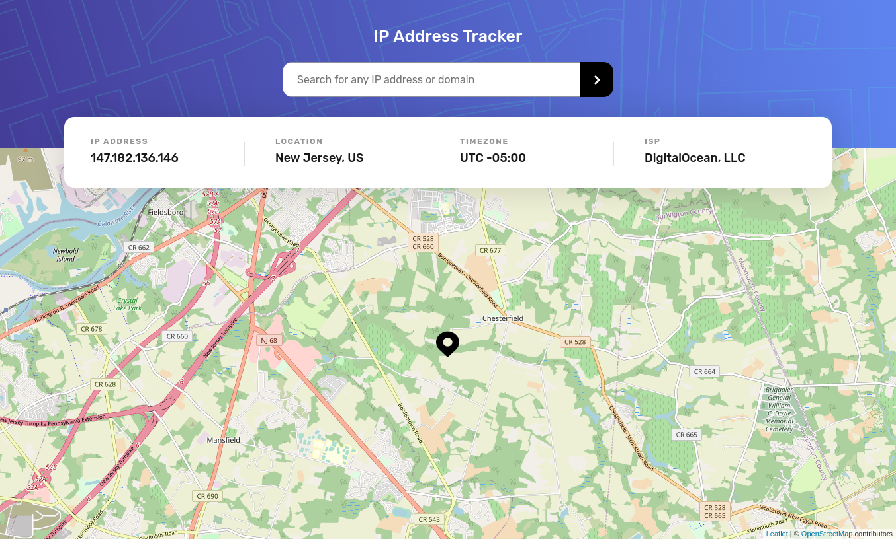

# Frontend Mentor - IP address tracker solution

This is a solution to the [IP address tracker challenge on Frontend Mentor](https://www.frontendmentor.io/challenges/ip-address-tracker-I8-0yYAH0). Frontend Mentor challenges help you improve your coding skills by building realistic projects. 

## Table of contents

- [Overview](#overview)
  - [The challenge](#the-challenge)
  - [Screenshot](#screenshot)
  - [Links](#links)
- [My process](#my-process)
  - [Built with](#built-with)
  - [What I learned](#what-i-learned)
  - [Continued development](#continued-development)
  - [Useful resources](#useful-resources)
- [Author](#author)
- [Acknowledgments](#acknowledgments)

## Overview

### The challenge

Users should be able to:

- View the optimal layout for each page depending on their device's screen size
- See hover states for all interactive elements on the page
- See their own IP address on the map on the initial page load
- Search for any IP addresses or domains and see the key information and location

### Screenshot

### Links

- Solution URL: (https://github.com/exxnnonymous/ip-address-tracker)
- Live Site URL: (https://ip-address-tracker-6jh3r20f1-beastprogrammer6-gmailcom.vercel.app/)

## My process

### Built with

- Semantic HTML5 markup
- CSS custom properties
- Flexbox
- Mobile-first workflow
- [React](https://reactjs.org/) - JS library
- [Next.js](https://nextjs.org/) - React framework
- [React Leaflet](https://react-leaflet.js.org/) - Leaflet Map 
- [IP Geolocation API by IPify](https://geo.ipify.org/) - Get Location from IP Address
- [GeoLocation Api](https://developer.mapquest.com/) - Used Geocoding Api (Get latitude and longitude by providing address)

### What I learned

Use this section to recap over some of your major learnings while working through this project. I learned a lot about new api. This is the first project where i used map api. 

## Author

- Frontend Mentor - [@exxnnonymous](https://www.frontendmentor.io/profile/exxnnonymous)
- Twitter - [@exxnnonymous](https://www.twitter.com/exxnnonymous)
